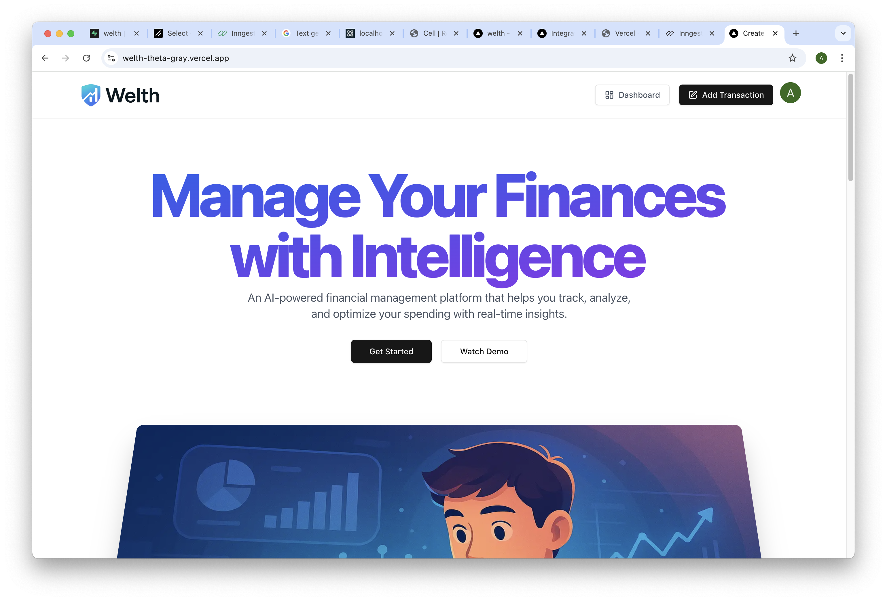

# Welth – AI Finance Management Platform

**Welth** is a full-stack AI-powered finance management platform built as part of my Master's Capstone Project. It helps users manage expenses, track budgets, and generate AI-generated reports, featuring modern web technologies like React 19, Next.js 15, Supabase, and Clerk.

## 📸 Demo Preview

  
[Live Demo (Vercel)](https://welth-theta-gray.vercel.app/)

## ✨ Features

- 🔐 User authentication via Clerk (email & Google OAuth)
- 📊 Income and expense tracking across multiple accounts
- 💰 Budget management with visual progress indicators
- 📸 AI-powered receipt scanning (auto-fill form fields)
- 🔄 Support for recurring transactions with scheduled automation
- 📧 Monthly financial reports and budget alert emails (via Inngest)
- 📈 Interactive dashboards and visualizations (bar chart, pie chart)
- 🛡️ Bot protection and rate limiting with Arcjet
- 🌐 Fully responsive UI built with ShadCN UI + Tailwind CSS

## 🙋‍♂️ My Role

- Sole developer – designed, implemented, and deployed the full-stack application from scratch
- Integrated third-party services (Clerk, Inngest, Arcjet) for auth, scheduling, and security
- Implemented AI receipt scanning using Gemini and automated insights via scheduled jobs

## 🛠️ Tech Stack

- **Frontend:** React 19, Next.js 15 (App Router)
- **UI:** Tailwind CSS, Shadcn UI, Lucide Icons
- **Form Handling:** React Hook Form + Zod
- **Authentication:** Clerk
- **Database:** Supabase (PostgreSQL) + Prisma ORM
- **Background Jobs:** Inngest
- **Security:** Arcjet
- **Deployment:** Vercel

## 📦 Getting Started

```bash
# Install dependencies
npm install

# Generate Prisma client
npx prisma generate

# Start dev server
npm run dev
```

## 🔐 Environment Variables

Create a `.env` file in the root directory and set the following values:

```env
# Clerk (Authentication)
NEXT_PUBLIC_CLERK_PUBLISHABLE_KEY=your_publishable_key
CLERK_SECRET_KEY=your_secret_key
NEXT_PUBLIC_CLERK_SIGN_IN_URL=/sign-in
NEXT_PUBLIC_CLERK_SIGN_UP_URL=/sign-up

# Supabase (Database)
DATABASE_URL=your_pooling_url
DIRECT_URL=your_direct_url

# Arcjet (Security)
ARCJET_KEY=your_arcjet_key

# Resend (Email service)
RESEND_API_KEY=your_resend_api_key

# Gemini (AI Receipt Scanner)
GEMINI_API_KEY=your_google_gemini_api_key

# Inngest (Background jobs)
INNGEST_EVENT_KEY=your_inngest_event_key
```

> ⚠️ **Do NOT commit `.env` to version control.** Store secrets securely.

## 📌 Notes

- Developed as a capstone project for my Master's in Software Engineering.
- Designed to demonstrate real-world full-stack development skills using modern frameworks and services.
- Includes production-ready features such as authentication, background jobs, AI integration, and performance/security enhancements.

## 📄 License

This project is intended for educational and portfolio use only.  
Please refer to the licenses of the original tools and tutorials if you plan to redistribute or use commercially.
